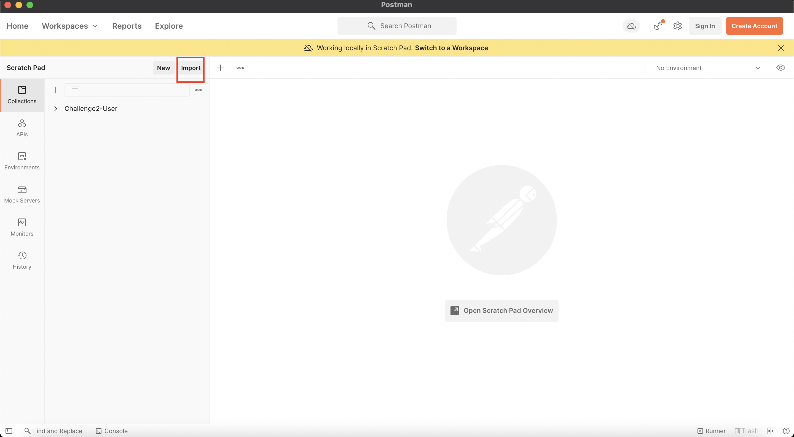

# Challenge #3

### Run App Steps:

1. Start the container:

    `docker-compose -f docker-compose-Reto3.yml  up -d --force-recreate`

2. Open Postman

3. Import `requestsChallenge3.json` clicking **Import** in Postman App

4. Make Requests:

    **4.1.** 

    Do the following request through postman by clicking **Send** the data is already setup 

    Exception Scenarios:  
    

    **4.2.** 

    Do the following request through postman by clicking **Send** the data is already setup 

    Exception Scenarios:  

5. Run Tests:

    **5.1.** Docker Test Container

    In docker you can check if all the test are passed.
    Just ...

    

6. ¡Keep enjoying our App!

### [Return to README](README.md)